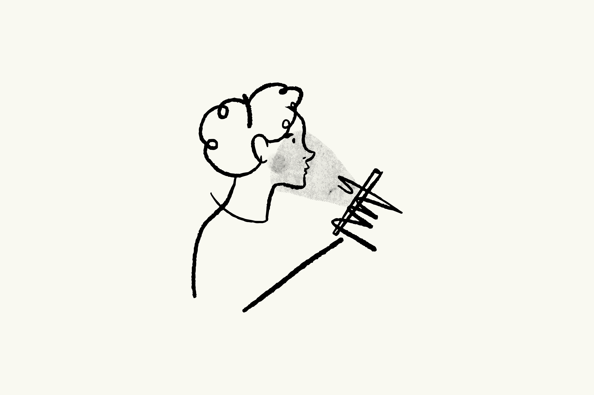
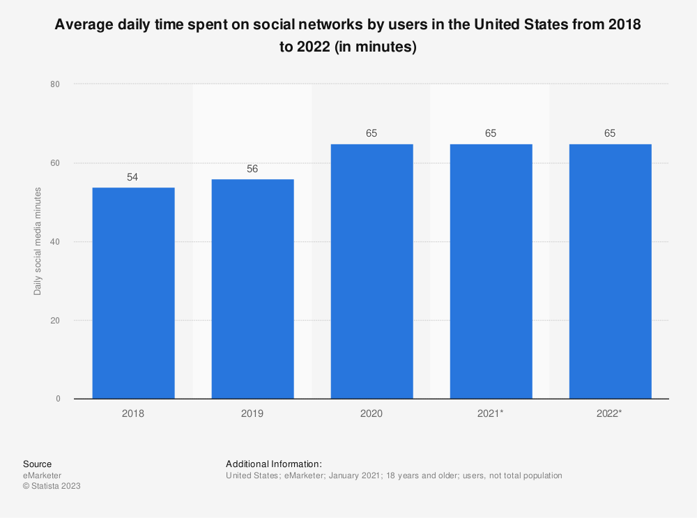

# Covid-19 and its effects on social media usage

## An investigation into how our digital identities were impacted by the world's largest psychological experiment: Coronavirus.

**Keywords:** digital identities, existential risks, Covid-19, pandemic, social media, personality types, character traits, introversion, neuroticism, extraversion, psychology.

Photo by <a href="https://unsplash.com/@visuals?utm_content=creditCopyText&utm_medium=referral&utm_source=unsplash">visuals</a> on <a href="https://unsplash.com/photos/white-and-black-cat-sketch-idbBOa-MQ-I?utm_content=creditCopyText&utm_medium=referral&utm_source=unsplash">Unsplash</a>  

## A Brief Introduction
Social media doesn’t control us, right? Assuredly it doesn’t influence how we think? Or how we spend our time? What we do in our free time? Surely not…

The COVID-19 pandemic has brought about unprecedented changes in various aspects of human life, with social media emerging as a prominent platform for communication and information exchange. Over the course of the pandemic, social media had a huge influence over us and our decisions. The average time spent on social media by American users significantly increased from 54 minutes and 56 minutes in the previous years to 65 minutes daily in 2020 - the year Covid arose. It’s predicted that in the next years, there will likely be no substantial shifts in the amount of time spent on social networking, and that numbers will stay stable. (Statista, 2023). The image of the mobile phone capturing the subject's full attention above links to the predominant theme of social media holding so much power that it is becoming overwhelming and controlling, in terms of how we think, as well as encapsulating the concept that social media is taking over our lives so much that it subsequently begins to impact daily tasks and processes, such as our sleep schedules, our perception of ourselves and our internal thought processes.

Covid-19 has had both a detrimental short-term and long-term impact on every individual on the planet; however, the magnitude of the effects has obviously differed between person to person. Different peoples’ presence on digital platforms may have varied over the course of the pandemic. It could have become more prevalent, in some cases, or could have declined drastically. Either way, personality types and character traits must have had an influence over certain coping mechanisms and the way people chose to live in lockdown and this article is going to explore that idea further. This essay will delve into the psychological impacts that the pandemic had on social media usage; specifically examining how different personality types responded to and engaged with social media during these challenging times. Social media platforms have become essential tools for communication, information dissemination, and social connection – and this was especially heightened during the pandemic, given the multiple lockdowns and restraints the country was put under, and how the role of our personality types shaped each individuals' online behaviours.

## Digital Identities: Visitors and Residents 

One approach that might help us comprehend and visualise digital identities is the ‘Visitors and Residents map’ (VR map) devised by David White (White & Le Cornu, 2017). It is based upon the reasoning behind people interacting with the internet, and individuals’ personal online presence. The two categories featured on the map are ‘visitor mode’ and ‘resident mode’; as well as being dependent on us carrying out the actions in a ‘personal’ or ‘professional’ way. When we are in visitor mode, we are not leaving any trace of our presence behind, whereas, when we are in resident mode, a social trace is left and even when we log off the internet, our online presence remains. An individual's many social media accounts, log in credentials, and entitlements are a few examples of what could potentially contribute to their digital identity. Below is my own personal VR map - highlighting all areas I use the most in my day-to-day life at this current moment in time.

VR map produced by myself using PowerPoint. 

## Existential Risks

## Conclusion 

[This](assessement.md) is an internal link to another page on my site - the assessment criteria. 

And [this](https://navigatingthedigitalworld.com) is an external link to the CS220 website. 

## References:
eMarketer. "Average daily time spent on social networks by users in the United States from 2018 to 2022 (in minutes)." Chart. March 11, 2021. Statista. Accessed January 16, 2024. https://www.statista.com/statistics/1018324/us-users-daily-social-media-minutes/
