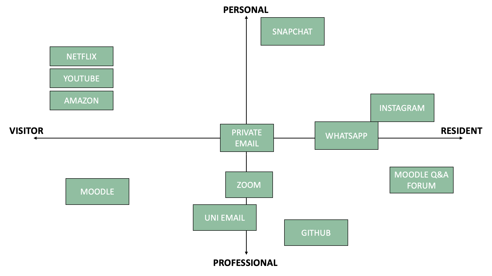

# Covid-19 and its drastic effects on society

## An investigation into how our digital identities were impacted by the world's largest psychological experiment: Coronavirus, and how different personalities coped with lockdown.

**Keywords:** digital identities, existential risks, Covid-19, pandemic, social media, personality types, character traits, introversion, neuroticism, extraversion, psychology.

Photo by <a href="https://unsplash.com/@visuals?utm_content=creditCopyText&utm_medium=referral&utm_source=unsplash">visuals</a> on <a href="https://unsplash.com/photos/white-and-black-cat-sketch-idbBOa-MQ-I?utm_content=creditCopyText&utm_medium=referral&utm_source=unsplash">Unsplash</a>  

## A Brief Introduction
Social media doesn’t control us, right? Assuredly it doesn’t influence how we think? Or how we spend our time? What we do in our free time? Surely not…

The COVID-19 pandemic has brought about unprecedented changes in various aspects of human life, with social media emerging as a prominent platform for communication and information exchange. Over the course of the pandemic, social media had a huge influence over us and our decisions. The average time spent on social media by American users significantly increased from 54 minutes and 56 minutes in the previous years to 65 minutes daily in 2020 - the year Covid arose. It’s predicted that in the next years, there will likely be no substantial shifts in the amount of time spent on social networking, and that numbers will stay stable. (Statista, 2023). The image of the mobile phone capturing the subject's full attention above links to the predominant theme of social media holding so much power that it is becoming overwhelming and controlling, in terms of how we think, as well as encapsulating the concept that social media is taking over our lives so much that it subsequently begins to impact daily tasks and processes, such as our sleep schedules, our perception of ourselves and our internal thought processes.

Covid-19 has had both a detrimental short-term and long-term impact on every individual on the planet; however, the magnitude of the effects has obviously differed between person to person. Different peoples’ presence on digital platforms may have varied over the course of the pandemic. It could have become more prevalent, in some cases, or could have declined drastically. Either way, personality types and character traits must have had an influence over certain coping mechanisms and the way people chose to live in lockdown and this article is going to explore that idea further. This essay will delve into the psychological impacts that the pandemic had on social media usage; specifically examining how different personality types responded to and engaged with social media during these challenging times. Social media platforms have become essential tools for communication, information dissemination, and social connection – and this was especially heightened during the pandemic, given the multiple lockdowns and restraints the country was put under, and how the role of our personality types shaped each individuals' online behaviours.

## Digital Identities: Visitors and Residents 

An individual's many social media accounts, log in credentials, and entitlements are a few examples of what could potentially contribute to their digital identity. One approach that might help us comprehend and visualise digital identities is the ‘Visitors and Residents map’ (VR map) devised by David White (White & Le Cornu, 2017). It is based upon the reasoning behind people interacting with the internet, and individuals’ personal online presence. The two categories featured on the map are ‘visitor mode’ and ‘resident mode’; as well as being dependent on us carrying out the actions in a ‘personal’ or ‘professional’ way. When we are in visitor mode, we are not leaving any trace of our presence behind, whereas, when we are in resident mode, a social trace is left and even when we log off the internet, our online presence remains. Below is my own personal VR map - highlighting all areas I use the most in my day-to-day life at this current moment in time.

VR map produced by myself using PowerPoint. 

## Existential Risks

An existential risk is a potential threat or hazard that has the potential to wipe out humanity, or seriously compromise the survival of society on a worldwide scale. It will be difficult for humans to survive and for modern societies to withstand because these hazards often involve changes that could have disastrous impacts and fundamentally alter the trajectory of human life. They might arise from a variety of sources; such as natural disasters, technological advancements, environmental changes or pandemic diseases. In order to better understand and reduce these potential hazards for humanity’s sake in the long-term, these existential risks are researched into regularly by academics. 

The coronavirus outbreak was a worldwide health crisis, and has killed nearly 7 million people, as of January 17, 2024 (Worldometer, 2024). It’s natural origin caused it to be very unpredictable, and therefore, harmful consequences arose subsequently because of the incalculability. The rapid spread of the virus resulted in severely strained healthcare systems, and consequently caused many hospital environments to become greatly overwhelmed – which then impacted their ability to look after those affected by the virus, as well as other patients not impacted by Covid-19. There was also a huge economic impact, in terms of both society and humans. Multiple lockdowns, governmental flaws, employment struggles, and restrictions for travel are all surrounded by the theme of money and with so many constraints, started declining economically. Additionally, there were great psychosocial impacts. These including increased health anxiety, losses of relatives and loved ones, decreases in mental health, and an increased use of social media. One example is the use of TikTok almost tripling in the 15-25 age category – rising from 10% before Covid-19 to 28% during (Statista, 2022). 

## Personality Types

Photo by <a href="https://unsplash.com/@ohamko?utm_content=creditCopyText&utm_medium=referral&utm_source=unsplash">Matúš Kovačovský</a> on <a href="https://unsplash.com/photos/sephia-photography-of-person-eIvLuyDjCQI?utm_content=creditCopyText&utm_medium=referral&utm_source=unsplash">Unsplash</a>

Personality types are a means to categorise and classify the characteristic patterns of thoughts, feelings, and behaviours that make each individual unique. There are various models and theories of personality, with each offering a different perspective on how to understand and categorize these traits. According to Eysenck (1947), the overall personality can be broken down into extraversion/introversion and neuroticism/stability - and psychoticism/normality, which was later added as a third dimension in 1966. Extraverts frequently exhibit impulsivity, optimism and carelessness; they are also more likely to take risks and be more outgoing and energetic. On the other hand, introverts are more reserved and calmer, and tend to keep to themselves a lot more. They are often readily in control of their emotions, and have a preference for smaller social gatherings. A highly neurotic person would likely be susceptible to overreacting and more easily inclined to become irritated, stressed or anxious. Whereas, a stable person generally maintains composure and rationality. Psychoticism is constituted by an inability to empathise and potentially engage in anti-social behaviour. It has also been linked to high levels of testosterone. 

## Discussion

The Covid-19 pandemic triggered a personal reassessment of the connections between the development of our digital identities and psychological coping methods during the multiple lockdowns we experienced. As individuals navigated the difficulties of isolation, and uncertainty of what the future holds, their unique personality traits played a crucial role in shaping how they responded to these circumstances. The intricate relationship between personality and the evolution of digital identities during the pandemic led to many research studies being conducted. Effectively using your digital identity on social media during the COVID-19 pandemic involves a combination of empathy, authenticity, and responsible communication.

## Conclusion 

Digital identities were impacted by the world's largest psychological experiment (Van Hoof, 2020), also more commonly known as coronavirus. Going into lockdown and spending prolonged amounts of time in our own company had a variety of different effect on different people. For example, there were negative effects in cases where some people became more anxious, and some became more cut off. However, there were also some positive impacts due to going into lockdown, such as, ‘a substantial decrease in depressive and anxiety symptoms’ (Yang et al., 2023). 

## Bibliography/References:
AudienceProject. "Share of individuals using TikTok during the coronavirus outbreak in the United States in 2020." Chart. June 12, 2020. Statista. Accessed January 17, 2024. https://www.statista.com/statistics/1207831/tiktok-usage-among-young-adults-during-covid-19-usa/. 

eMarketer. "Average daily time spent on social networks by users in the United States from 2018 to 2022 (in minutes)." Chart. March 11, 2021. Statista. Accessed January 16, 2024. https://www.statista.com/statistics/1018324/us-users-daily-social-media-minutes/.

Eysenck, H. J. (1947). Dimensions of personality. Kegan Paul.
Kumar, V. V., & Tankha, G. (2022). The Relationship between Personality Traits and COVID-19 Anxiety: A Mediating Model. Behavioral sciences (Basel, Switzerland), 12(2), 24. https://doi.org/10.3390/bs12020024. 

Worldometer. "Coronavirus Death Toll." Accessed January 17, 2024. https://www.worldometers.info/coronavirus/coronavirus-death-toll/.

Van Hoof, Elke. "Lockdown is the world's biggest psychological experiment - and we will pay the price." Accessed January 15, 2024. https://www.weforum.org/agenda/2020/04/this-is-the-psychological-side-of-the-covid-19-pandemic-that-were-ignoring/.

Yang, X., Lawrence, A.J., Harrison, P. et al. Positive effects of the COVID-19 pandemic on depression and anxiety in Chinese adolescents. Eur Child Adolesc Psychiatry (2023). https://doi.org/10.1007/s00787-023-02263-z.
